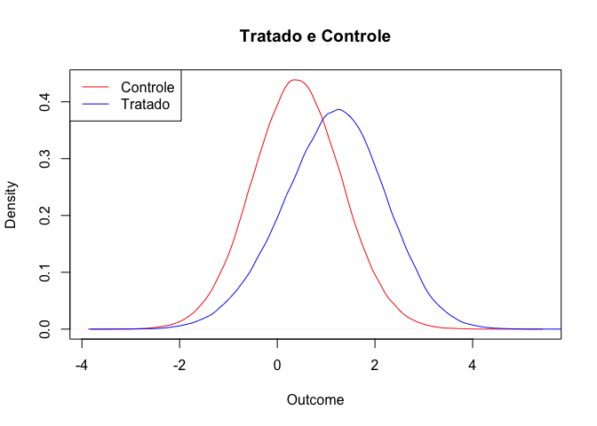

The goal of this session is to show how Lee's approach works through a simple simulation.

## A simple selection model

Let us assume that potential outcomes are distributed according to

$$ \begin{pmatrix}
Y(O) \\
Y(1)
\end{pmatrix} \sim \mathcal{N}\left(\begin{pmatrix}
0 \\
1
\end{pmatrix},  \begin{pmatrix} 1& 0.9 \\
0.9 & 1
\end{pmatrix} \right)$$

We'll define outcomes for selection as follows

$$
S(0)|Y(0),Y(1) \sim \text{Bernoulli}( p(Y(0)) ) \\
S(1)|S(0),Y(0),Y(1) \sim  S(0) \lor \text{Bernoulli}( p(1-Y(1)) )
$$

where $p(z) = \frac{\exp(x)}{1 + \exp(x)}$ is the logistic link function.

We introduce a fictitious treatment $D \sim \text{Bernoulli}(0.5)$. This framework satisfies all hypotheses for Lee's sharp bounds. In particular, we have

$$
 D \perp Y(0),Y(1),S(0),S(1)
$$
and, crucially

$$
S(1)\geq S(0)
$$

Let's create a function that simulates a sample from this population, and reports both the ``full'' dataset, with variables not observed by the researcher; and the true dataset. We'll set $N$ really high, so we don't worry about estimation error. 


```r
#Draws from multivariate normal
library(mvtnorm)
```

```
## Warning: package 'mvtnorm' was built under R version 3.6.2
```

```r
#Sets seed to allow for replication
set.seed(1234)

gen.data <- function(N){
  mean.outcomes = c(0,1)
  vcov.outcomes = cbind(c(1,0.9),c(0.9,1))
  
  potential_outcomes =  rmvnorm(N, mean = mean.outcomes, sigma = vcov.outcomes)
  colnames(potential_outcomes) = c("Y0", "Y1")
  
  potential_sample = t(apply(potential_outcomes, 1, function(x){
    S0 = rbinom(1, 1, plogis(x[1]))
    S1 = max(S0, rbinom(1, 1, plogis(-1-x[2])))
    return(c("S0"=S0, "S1" = S1))
  }))
  
  treatment = rbinom(N, 1, 0.5)
  
  full.data = cbind(potential_outcomes, potential_sample, "D" = treatment)
  

  Y = (potential_outcomes*potential_sample)[,1]*(1-treatment) + (potential_outcomes*potential_sample)[,2]*(treatment) 
  
  Y[Y==0] = NA
  
  observed.data = cbind("Y" =  Y, "D" = treatment)
  return(list("full"= full.data, "observed" = observed.data))
}

dados = gen.data(1000000)

inteiro = dados$full
observado = dados$observed

plot(density(inteiro[,"Y0"]), main = "Y(0) e Y(1)", xlab= "Outcome",col = "red")
lines(density(inteiro[,"Y1"]), main = "Y(0) e Y(1)", xlab= "Outcome", col = "blue")
legend("topleft", legend = c("Y0","Y1"), col = c("red","blue"), lwd = 1)
```

<!-- -->

```r
mean(inteiro[,"Y1"]) - mean(inteiro[,"Y0"])
```

```
## [1] 1.000227
```

```r
plot(density(observado[observado[,"D"]==0&!is.na(observado[,"Y"]),"Y"]), main = "Tratado e Controle", xlab= "Outcome",col = "red")
lines(density(observado[observado[,"D"]==1&!is.na(observado[,"Y"]),"Y"]), col = "Blue")
legend("topleft", legend = c("Controle","Tratado"), col = c("red","blue"), lwd = 1)
```

<!-- -->

```r
mean(observado[observado[,"D"]==1&!is.na(observado[,"Y"]),"Y"]) - mean(observado[observado[,"D"]==0&!is.na(observado[,"Y"]),"Y"])
```

```
## [1] 0.73991
```

What is the parameter of interest in Lee?

$$
E[Y(1)-Y(0)|S(1)=S(0)=1]
$$
Let's calculate this parameter using _full_, unobserved data (this parameter is only set-identified from observed data in Lee's framework!!).


```r
mean(inteiro[inteiro[,"S0"]==1&inteiro[,"S1"]==1,"Y1"]) - mean(inteiro[inteiro[,"S0"]==1&inteiro[,"S1"]==1,"Y0"]) 
```

```
## [1] 0.9592552
```

How can we estimate sharp bounds for this effect, from the data?


```r
observado = cbind(observado, "S" = !is.na(observado[,"Y"]))
#Convert to dataframe
observado = data.frame(observado)
p_0 = 1- ((sum(observado$S==1&observado$D==0))/(sum(observado$D==0)))/(((sum(observado$S==1&observado$D==1))/(sum(observado$D==1))))
G= observado$Y[observado$D==1&observado$S==1]
quantiles = quantile(G, c(p_0,1-p_0))

LB = mean(G[G<=quantiles[2]]) -  mean(observado$Y[observado$D==0&observado$S==1])
UB = mean(G[G>=quantiles[1]]) -  mean(observado$Y[observado$D==0&observado$S==1])

print(LB)
```

```
## [1] 0.4357457
```

```r
print(UB)
```

```
## [1] 1.060212
```

## References

Lee, D. S. (2009). Training, wages, and sample selection: Estimating sharp bounds on treatment effects. The Review of Economic Studies, 76(3), 1071-1102.

