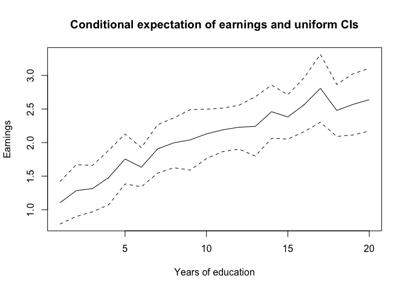

The code below computes the upper bound to the average treatment effect (ATE) using the Monotone Treatment Response (MTR) and Monotone Treatment Selection (MTS) assumptions of Manski and Pepper (2000). The support of the treatment variable and the outcome vector should be passed ordered __in the direction the assumption holds__; so in some cases you may want to pass $-\text{outcome}$ to the function. The function returns the upper bound to the ATE of changing treatment status from entry $j$ to entry $j+1$ in the support, for treatment values $j=1,2\ldots \text{Number of points in the support - 1}$. Bounds are computed as in Equation 23 of Manski and Pepper (2000).


```r
#Package to use parallel computing inside the estimate_effect function: 
#the way I did will work in Unix (it won't parallelize in Windows)
library(parallel)

#Function to compute the Bounds under MTR and MTS of Manski and Pepper (2000). Takes as arguments:
# Treatment vec: a N x 1 vector with the treatment assigned to each unit in the sample:
# Values vec: a N x 1 vector with the outcome for each unit in the sample:
# Support treatment: the support of the treatment. Should be ordered in the direction the assumptions hold.
# Weight: weights for computing expectations. If NULL, all observations have equal weight.
# Obs: these functions do NOT accept missing. Discard missing before using
# Obs 2: function will return the upper bounds for an increase from support_treatment[j] to support_treatment[j+1],
# for j = 1,2 \ldots length(support_treatment)
estimate_effect <- function(treatment_vec, values_vec , support_treatment, weights = NULL)
{
  if(is.null(weights))
    weights = rep(1, length(treatment_vec))
  
  indices_treatment_vec = match(treatment_vec, support_treatment)
  
  results =mclapply(1:(length(support_treatment)-1), function(j){
    s = support_treatment[j]
    t = support_treatment[j+1]
    
    #Computing terms for the bound
    terms = sapply(1:(length(support_treatment)), function(j_prime){
      s_prime = j_prime
      
      keep_calc = indices_treatment_vec==j_prime
      
      cond_exp = sum(values_vec[keep_calc]*weights[keep_calc])/sum(weights[keep_calc])
      
      if((j_prime > j+1)|(j_prime<j))
      {
        prop = sum(weights[keep_calc])/sum(weights)
        
        value = (prop*cond_exp)*(1*(j_prime > j+1) -1*(j_prime < j))
      } else if(j_prime == j)
      {
        
        prop = sum(weights[indices_treatment_vec>=j_prime])/sum(weights)
        value = -prop*cond_exp
        
      } else if(j_prime == j+1)
      {
        prop = sum(weights[indices_treatment_vec<=j_prime])/sum(weights)
        value = prop*cond_exp
      }
      
      return(value)
    })
    #print(j)
    #print(terms)
    
    #Upper bound is sum of terms
    upper_bound =  sum(terms,na.rm = T)
    return(upper_bound)
    
  })
  results = do.call(c, results)
  return(results)
}
```

Let's create an example with fake data. We will suppose we have data on earnings and years of education on 10,000 individuals. We will assume these come from a random sample of 200 firms, where all firms were equally likely to be sampled from the population (so their sampling weights are equal to 1).


```r
#Fake data: Effect of years of schooling on wages
set.seed(1234)

years_of_schooling = 1:20

#Sample size
N = 10000

#Creating data on years of schooling
data = data.frame("schooling" = sample(years_of_schooling, N, replace =T))
#Each person has weight 1
data$weight = 1

#Let's pretend data was sampled from Nfirms firms.
Nfirms = 200

firm_dataset = data.frame("firm_id" = 1:Nfirms)
firm_index = sample(firm_dataset$firm_id, N, replace = T)

data$firm_id = firm_index 
data$firm_weight = 1

#Now let's create the outcome. We will include a firm effect additively in the outcome

#Firm shock
firm_dataset$firm_shock = rchisq(Nfirms,1)

#Chi-squared firm shock
data_with_shock = merge(data,firm_dataset, by="firm_id", all.x = T, all.y = F)

data_with_shock$wage = sin(data_with_shock$schooling*0.5*pi/(max(years_of_schooling)))*exp(rnorm(N)) +
  data_with_shock$firm_shock

data = data_with_shock
data = data[,!colnames(data)%in%"firm_shock"]

#Let's introduce some missing data in the outcome (at random) just to showcase how the function works
data$wage[sample(N, 10, replace = F)] = NA

#Point estimate
point.est =  estimate_effect(data$schooling[!is.na(data$wage)],
                             data$wage[!is.na(data$wage)],
                             years_of_schooling,  weights = data$weight[!is.na(data$wage)] )

print(point.est)
```

```
##  [1] 0.9664720 0.7958568 0.7940621 0.7088111 0.4577089 0.6310701 0.4719050
##  [8] 0.4299449 0.4443377 0.4247921 0.4162453 0.4056731 0.5429470 0.4124671
## [15] 0.5721769 0.7227137 0.3942338 0.5240993 0.5823426
```

So the function returns the upper bounds of 19 ATES. 

Next, let's compute confidence intervals using the bootstrap. We will bootstrap firms according to their weights to capture the (assumed) sampling process.


```r
#Creating dataset with firms to use in bootstrap
base_ind = aggregate(cbind("weight" = data$firm_weight), list("firm_id" = data$firm_id), FUN = mean)

values.bs = c()
for(ss in 1:100)
{
  print(ss)
  
  #Drawing firms
  sample.draw = sample(base_ind$firm_id, replace = T, prob = base_ind$weight)
  
  #Creating artificial dataset
  data.artificial = merge(cbind("firm_id" = sample.draw), data, by = "firm_id", all.x = T, all.y = F)
  
  #Computing estimate in bs sample
  point.est.bs =  estimate_effect(data.artificial$schooling[!is.na(data.artificial$wage)],
                                  data.artificial$wage[!is.na(data.artificial$wage)],
                                  years_of_schooling,  weights = data.artificial$weight[!is.na(data.artificial$wage)] )
  
  values.bs =rbind(values.bs, point.est.bs)
}
```

```
## [1] 1
## [1] 2
## [1] 3
## [1] 4
## [1] 5
## [1] 6
## [1] 7
## [1] 8
## [1] 9
## [1] 10
## [1] 11
## [1] 12
## [1] 13
## [1] 14
## [1] 15
## [1] 16
## [1] 17
## [1] 18
## [1] 19
## [1] 20
## [1] 21
## [1] 22
## [1] 23
## [1] 24
## [1] 25
## [1] 26
## [1] 27
## [1] 28
## [1] 29
## [1] 30
## [1] 31
## [1] 32
## [1] 33
## [1] 34
## [1] 35
## [1] 36
## [1] 37
## [1] 38
## [1] 39
## [1] 40
## [1] 41
## [1] 42
## [1] 43
## [1] 44
## [1] 45
## [1] 46
## [1] 47
## [1] 48
## [1] 49
## [1] 50
## [1] 51
## [1] 52
## [1] 53
## [1] 54
## [1] 55
## [1] 56
## [1] 57
## [1] 58
## [1] 59
## [1] 60
## [1] 61
## [1] 62
## [1] 63
## [1] 64
## [1] 65
## [1] 66
## [1] 67
## [1] 68
## [1] 69
## [1] 70
## [1] 71
## [1] 72
## [1] 73
## [1] 74
## [1] 75
## [1] 76
## [1] 77
## [1] 78
## [1] 79
## [1] 80
## [1] 81
## [1] 82
## [1] 83
## [1] 84
## [1] 85
## [1] 86
## [1] 87
## [1] 88
## [1] 89
## [1] 90
## [1] 91
## [1] 92
## [1] 93
## [1] 94
## [1] 95
## [1] 96
## [1] 97
## [1] 98
## [1] 99
## [1] 100
```

```r
#Efron's Percentile method
lower.ci = apply(values.bs, 2, quantile, probs = 0.025)
upper.ci = apply(values.bs, 2, quantile, probs = 0.975)

#Using the fact that asymptotic distribution of estimator is normal
sd.bs = apply(values.bs, 2, sd)
lower.ci.normal =  point.est + qnorm(0.025)*sd.bs
upper.ci.normal =  point.est + qnorm(0.975)*sd.bs

#Percentile method - with recentering
lower.ci.recentering = 2*point.est - apply(values.bs, 2, quantile, probs = 0.975)
upper.ci.recentering = 2*point.est - apply(values.bs, 2, quantile, probs = 0.025)

print("No recentering")
```

```
## [1] "No recentering"
```

```r
print(lower.ci)
```

```
##  [1] 0.8620261 0.6706495 0.6316214 0.5807043 0.3575262 0.4989503 0.3580235
##  [8] 0.2830424 0.2865734 0.2773542 0.2894843 0.2774984 0.3925267 0.2468456
## [15] 0.4233040 0.4793475 0.1831132 0.3565493 0.3920115
```

```r
print(upper.ci)
```

```
##  [1] 1.0719329 0.9427071 0.9800251 0.8470697 0.5649065 0.7283043 0.5791316
##  [8] 0.5742060 0.5636497 0.5868893 0.5141683 0.5709373 0.7195720 0.5560463
## [15] 0.7277187 0.9235777 0.5800660 0.6965725 0.7538893
```

```r
print("Using that Asymptotic Distribution is Gaussian (in this case it is!!)")
```

```
## [1] "Using that Asymptotic Distribution is Gaussian (in this case it is!!)"
```

```r
print(lower.ci.normal)
```

```
##  [1] 0.8472290 0.6562505 0.6214826 0.5690665 0.3369333 0.5079767 0.3566508
##  [8] 0.2814262 0.3020722 0.2722574 0.2981675 0.2475387 0.3827346 0.2506102
## [15] 0.4142750 0.5049392 0.1971505 0.3399122 0.3900058
```

```r
print(upper.ci.normal)
```

```
##  [1] 1.0857150 0.9354631 0.9666415 0.8485557 0.5784846 0.7541634 0.5871593
##  [8] 0.5784637 0.5866032 0.5773267 0.5343232 0.5638075 0.7031594 0.5743239
## [15] 0.7300787 0.9404882 0.5913171 0.7082865 0.7746793
```

```r
print("Recentered")
```

```
## [1] "Recentered"
```

```r
print(lower.ci.recentering)
```

```
##  [1] 0.8610111 0.6490064 0.6080990 0.5705524 0.3505114 0.5338359 0.3646785
##  [8] 0.2856839 0.3250258 0.2626949 0.3183224 0.2404088 0.3663219 0.2688878
## [15] 0.4166350 0.5218497 0.2084016 0.3516262 0.4107958
```

```r
print(upper.ci.recentering)
```

```
##  [1] 1.0709180 0.9210640 0.9565027 0.8369178 0.5578917 0.7631898 0.5857865
##  [8] 0.5768475 0.6021020 0.5722299 0.5430064 0.5338478 0.6933673 0.5780886
## [15] 0.7210497 0.9660799 0.6053544 0.6916494 0.7726736
```

All methods yielded similar CIs.

## Testable assumptions of MTR and MTS

As argued in Manski and Pepper (2000), a testable assumption of the __joint__ MTR+MTS hypotheses is that the conditional expectation of the outcome is weakly increasing in treatment status (already ordered so the assumption holds). We could test this in two ways. The first one would be to conduct sequential testing of $H_0: \beta_j = \beta_{j+1}$ against the alternative that $\beta_j > \beta_{j+1}$; where $\beta_j$ is the conditional expectation of the outcome given that treatment status equals the $j$-th point in the support. Let's implement this. We test the null for several points in the support.


```r
library(lmtest)
```

```
## Loading required package: zoo
```

```
## Warning: package 'zoo' was built under R version 3.6.2
```

```
## 
## Attaching package: 'zoo'
```

```
## The following objects are masked from 'package:base':
## 
##     as.Date, as.Date.numeric
```

```r
library(sandwich)
library(car)
```

```
## Warning: package 'car' was built under R version 3.6.2
```

```
## Loading required package: carData
```

```
## Warning: package 'carData' was built under R version 3.6.2
```

```r
esp_condicional = lm(wage~-1+as.factor(schooling),data, weights = data$weight)
coeftest(esp_condicional, vcov. = vcovCL, cluster = data$firm_id)
```

```
## 
## t test of coefficients:
## 
##                        Estimate Std. Error t value  Pr(>|t|)    
## as.factor(schooling)1  1.102148   0.107842 10.2200 < 2.2e-16 ***
## as.factor(schooling)2  1.284260   0.131560  9.7618 < 2.2e-16 ***
## as.factor(schooling)3  1.314099   0.118002 11.1363 < 2.2e-16 ***
## as.factor(schooling)4  1.479683   0.138130 10.7122 < 2.2e-16 ***
## as.factor(schooling)5  1.755270   0.126621 13.8624 < 2.2e-16 ***
## as.factor(schooling)6  1.633142   0.099549 16.4054 < 2.2e-16 ***
## as.factor(schooling)7  1.905849   0.122962 15.4994 < 2.2e-16 ***
## as.factor(schooling)8  1.996466   0.126658 15.7626 < 2.2e-16 ***
## as.factor(schooling)9  2.039530   0.153564 13.2813 < 2.2e-16 ***
## as.factor(schooling)10 2.129501   0.125433 16.9772 < 2.2e-16 ***
## as.factor(schooling)11 2.189616   0.110439 19.8264 < 2.2e-16 ***
## as.factor(schooling)12 2.228796   0.111464 19.9956 < 2.2e-16 ***
## as.factor(schooling)13 2.240697   0.150693 14.8693 < 2.2e-16 ***
## as.factor(schooling)14 2.459282   0.135187 18.1917 < 2.2e-16 ***
## as.factor(schooling)15 2.382156   0.112549 21.1654 < 2.2e-16 ***
## as.factor(schooling)16 2.564032   0.136980 18.7183 < 2.2e-16 ***
## as.factor(schooling)17 2.808555   0.172464 16.2848 < 2.2e-16 ***
## as.factor(schooling)18 2.479074   0.132115 18.7646 < 2.2e-16 ***
## as.factor(schooling)19 2.568306   0.155221 16.5461 < 2.2e-16 ***
## as.factor(schooling)20 2.638992   0.159484 16.5471 < 2.2e-16 ***
## ---
## Signif. codes:  0 '***' 0.001 '**' 0.01 '*' 0.05 '.' 0.1 ' ' 1
```

```r
variancia = vcovCL(esp_condicional, cluster = data$firm_id)

for(ano in years_of_schooling[1:(length(years_of_schooling)-1)])
{
  print(paste("Testing equality between conditional expectations of", ano, "and", ano+1, "years of education against alternative that", ano, "year is greater."))
  
  lin_vec = -1*(names(esp_condicional$coefficients)%in%paste("as.factor(schooling)",ano,sep=""))  +1*(names(esp_condicional$coefficients)%in%paste("as.factor(schooling)",ano+1,sep=""))
  tstat = lin_vec%*%esp_condicional$coefficients/sqrt(t(lin_vec)%*%variancia%*%lin_vec)
  print(paste("P-value is", pnorm(tstat)))
}
```

```
## [1] "Testing equality between conditional expectations of 1 and 2 years of education against alternative that 1 year is greater."
## [1] "P-value is 0.982115603893415"
## [1] "Testing equality between conditional expectations of 2 and 3 years of education against alternative that 2 year is greater."
## [1] "P-value is 0.617379031081133"
## [1] "Testing equality between conditional expectations of 3 and 4 years of education against alternative that 3 year is greater."
## [1] "P-value is 0.895532558058149"
## [1] "Testing equality between conditional expectations of 4 and 5 years of education against alternative that 4 year is greater."
## [1] "P-value is 0.997481830159355"
## [1] "Testing equality between conditional expectations of 5 and 6 years of education against alternative that 5 year is greater."
## [1] "P-value is 0.109031403032063"
## [1] "Testing equality between conditional expectations of 6 and 7 years of education against alternative that 6 year is greater."
## [1] "P-value is 0.996385764204431"
## [1] "Testing equality between conditional expectations of 7 and 8 years of education against alternative that 7 year is greater."
## [1] "P-value is 0.807405611120236"
## [1] "Testing equality between conditional expectations of 8 and 9 years of education against alternative that 8 year is greater."
## [1] "P-value is 0.618831678871064"
## [1] "Testing equality between conditional expectations of 9 and 10 years of education against alternative that 9 year is greater."
## [1] "P-value is 0.744970536350431"
## [1] "Testing equality between conditional expectations of 10 and 11 years of education against alternative that 10 year is greater."
## [1] "P-value is 0.664910547819222"
## [1] "Testing equality between conditional expectations of 11 and 12 years of education against alternative that 11 year is greater."
## [1] "P-value is 0.647574879080795"
## [1] "Testing equality between conditional expectations of 12 and 13 years of education against alternative that 12 year is greater."
## [1] "P-value is 0.533521833856298"
## [1] "Testing equality between conditional expectations of 13 and 14 years of education against alternative that 13 year is greater."
## [1] "P-value is 0.911820208192461"
## [1] "Testing equality between conditional expectations of 14 and 15 years of education against alternative that 14 year is greater."
## [1] "P-value is 0.283100916677615"
## [1] "Testing equality between conditional expectations of 15 and 16 years of education against alternative that 15 year is greater."
## [1] "P-value is 0.914680665176677"
## [1] "Testing equality between conditional expectations of 16 and 17 years of education against alternative that 16 year is greater."
## [1] "P-value is 0.928120362436459"
## [1] "Testing equality between conditional expectations of 17 and 18 years of education against alternative that 17 year is greater."
## [1] "P-value is 0.0187105687139823"
## [1] "Testing equality between conditional expectations of 18 and 19 years of education against alternative that 18 year is greater."
## [1] "P-value is 0.727688553349503"
## [1] "Testing equality between conditional expectations of 19 and 20 years of education against alternative that 19 year is greater."
## [1] "P-value is 0.686079251752975"
```

The problem with the above approach is that it is subject to the size distortions induced by multiple hypothesis testing that we have seen in the first course. An alternative, suggested by Manski and Pepper, is to consider __uniform__ confidence intervals. Let $\beta_{j}: j = 1,\ldots J$ denote the conditional expectation in the $J$ support points. Our goal is to construct a random set in $\mathbb{R}^J$, $\hat{C}$, such that:

$$\mathbb{P}[(\beta_j)_{j} \in \hat{C}] \geq 1-\alpha$$
where $1 - \alpha$ is the confidence level. If such a confidence set contains monotonic maps $j \mapsto f(j)$, then the data does not provide enough evidence to reject monotonicity  at the $\alpha$ significance level.

How can we construct such a set? Suppose that we have an estimator $\hat{\beta} := (\hat{\beta}_j)_j$. Let $\boldsymbol{\beta} : = (\beta_j)_j$ denote the true parameter. Suppose the estimator satisfies (at least approximately):

$$\hat{\beta}  \sim N(\boldsymbol{\beta}, \mathbb{V}(\hat{\beta})) $$
where $\mathbb{V}(\hat{\beta})$ is positive definite. In this case, one has:

$$\mathbb{V}[\hat{\beta}]^{-1/2}(\hat{\beta} -\boldsymbol{\beta}) \sim N(\mathbf{0}_{J\times 1}, \mathbb{I}_{J\times J}) $$


and  a $1-\alpha$ uniform confidence interval can be contructed by the hyperrectangle:


$$[\hat{\beta} - s_{1  - \alpha}d, \hat{\beta}  +s_{1-\alpha} d] := \prod_{j=1}^J[\hat{\beta}_j - s_{1  - \alpha}\cdot \operatorname{sd}(\hat{\beta}_j), \hat{\beta}_j  +s_{1-\alpha} \cdot \operatorname{sd}(\hat{\beta}_j)]  $$

where $d$ is a vector with $\operatorname{sd}(\hat{\beta}_j)$ in entry $j$. Here, $s_{c}$ is the $c$-quantile of the random variable:

$$S: = \max_{j=1,2\ldots J}|Z_j|$$
with 
$$\begin{pmatrix}
Z_1 \\
Z_2 \\
\ldots \\
Z_J 
\end{pmatrix} \sim  N(\mathbf{0}, D\mathbb{V}(\hat{\beta})D)$$

where $D$ is a diagonal matrix with $1/\operatorname{sd}(\hat{\beta}_j), j=1,\ldots J$ in the main diagonal. When there is no dependence between the estimators, the variance simplifies to an identity matrix, so we have a multivariate standard normal vector. 

To see how this approach leads to valid confidence sets, we note that:

$$
\mathbb{P}[\boldsymbol{\beta} \in[\hat{\beta} - s_{1  - \alpha}d, \hat{\beta}  +s_{1-\alpha}d]] = \mathbb{P}\left[\cap_{j=1}^J \frac{|\hat{\beta}_j - \beta|}{\operatorname{sd}(\hat{\beta}_j)} \leq s_{1-\alpha}\right] = \\ =\mathbb{P}[\cap_{j=1}^J Z_J \leq s_{1-\alpha}] = 1 - \alpha
$$
The critical values $s_c$ are obtained via simulation. Here, the rescaling by $\operatorname{sd}(\hat{\beta}_j)$ used in the construction does not affect the confidence of the set, and is solely included to try to minimise the volume of the confidence set (i.e. we could dispense the rescaling in the confidence set formula by replacing $d$ with a vector of ones; in this case, we also replace the matrix $D$ in the definition of the $Z_j$ with an identity matrix).

Let's implement the approach above in our context.


```r
#Drawing from multivariate normal
library(mvtnorm)
```

```
## Warning: package 'mvtnorm' was built under R version 3.6.2
```

```r
#Computing d vector and D matrix
d = sqrt(diag(variancia))
D = diag(1/d)

confidence =  0.95
#Computing critical values via simulation
#1000 replications
sims = rmvnorm(1000, mean = rep(0,nrow(variancia)), D%*%variancia%*%D)
distr_stat =apply(sims, 1, function(x){max(abs(x))})

critical_value = quantile(distr_stat, confidence)

lower.ci.uniform = esp_condicional$coefficients - critical_value*d
upper.ci.uniform = esp_condicional$coefficients + critical_value*d

#Plotting
plot(years_of_schooling, esp_condicional$coefficients ,  ylim = c(min(lower.ci.uniform),max(upper.ci.uniform)), xlab = "Years of education", ylab = "Earnings", main = "Conditional expectation of earnings and uniform CIs",type = "l")

lines(years_of_schooling, lower.ci.uniform, lty = 2)
lines(years_of_schooling, upper.ci.uniform, lty = 2)
```

<!-- -->

So by the figure above, we don't reject monotonicity, right?

## References
Manski, C. F., & Pepper, J. V. (2000). Monotone Instrumental Variables: With an Application to the Returns to Schooling. Econometrica, 68, 997-1010.
