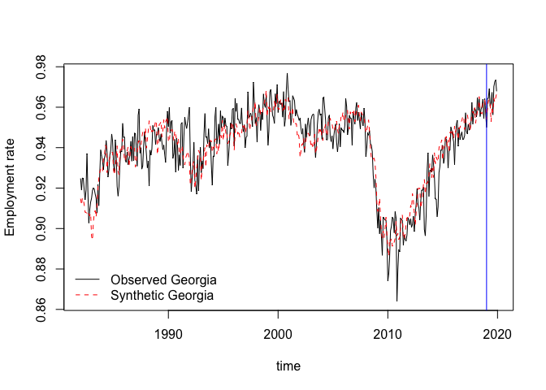
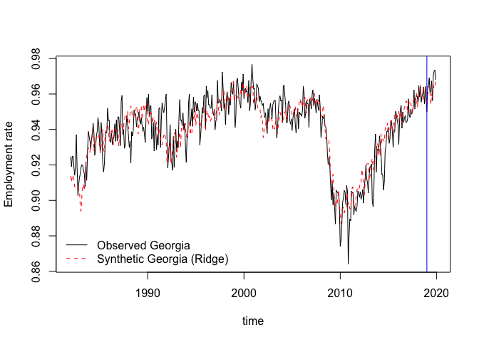
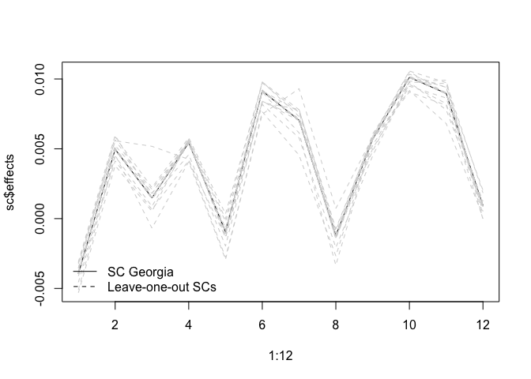
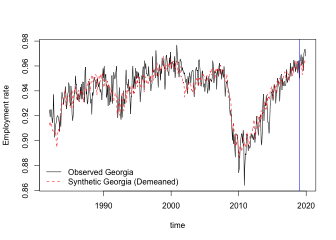

## The Synthetic Control Method

Let $y_{jt}$ denote an outcome of interest in unit $j$ at period $t$. Suppose we observe $j = 1,\ldots J$ units over $t = 1 \ldots T$ periods. For example, we observe a panel on the per capita GDP of $J$ countries over $T$ years. Assume that unit $1$ is exposed to a policy intervention at period $1 < t^* < T$. The __synthetic control__ estimator of the treatment effect at period $t \geq t^*$ is:

$$\hat{\alpha}_{1t} =  y_{1t} - \widehat{y_{1t}(0)} = y_{1t}  - \sum_{j=1}^{J-1} \hat{w}_j y_{j+1,t} \\
\hat{w}_j  \geq 0 \quad j = 1 \ldots J-1 \\
\sum_{j=1}^{J-1} \hat{w}_j = 1 $$

i.e. the idea is to impute the missing potential outcome at the post-treatment period, $y_{1t}(0), t \geq t^*$, as a convex combination of the observed (non-treated) outcome of the control units. The restriction to convex weights safeguards against __extrapolation biases__ (though possibly at the cost of __interpolation biases__). It also leads to man easy-to-interpret estimator.

How does one choose the weights $\hat{w}_j$? The idea is that the weights should be able to reproduce the observed outcome of the treated unit in the __pre-treatment period__. Let $X_1$ be __a $K \times 1$ vector of predictors of the outcome of interest in the treated unit at the pre-treatment period__. Predictors may include the outcomes in the pre-treatment period itself (more on this later). Similarly, let $\mathbf{X}_0$ be a $K \times (J-1)$ matrix stacking these same predictors across the control units. For a $K \times K$ nonnegative diagonal matrix $V = \text{diag}(v_1, \ldots v_K)$, define:

$$w^*(V) = (w^*_1(V), \ldots w^*_{J-1}(V)) \in  \text{argmin}_{w \in \Delta^{J-2}} ( \mathbf{X}_1 - \mathbf{X}_0 w)'  V ( \mathbf{X}_1 - \mathbf{X}_0 w) \quad (1)$$

where $\Delta^{J-2} : = \{w \in \mathbb{R}^{J-1}: w_j \geq 0, \sum_{j=1}^{J-1} w_j = 1\}$. The weights are then chosen as $\hat{w} = w^*(V^*)$, where:

$$V^* \in \text{argmin}_{v_1\ldots v_ K\geq 0} \sum_{t \in \mathcal{T}}\left(y_{1t} - \sum_{j=1}^{J-1} w^*(V) \cdot y_{j+1,t}\right)^2 \quad (2)$$
where $\mathcal{T} \subseteq \{1,\ldots t^*-1\}$ is a subset of the pre-treatment periods. In particular, Abadie (2020) suggests a sample splitting procedure where the pre-treatment period is split into a _training_ and _evaluation_ period: predictors $\mathbf{X}$ consist of controls at the training period; whereas $\mathcal{T}$ are the evaluation periods. The author argues this procedure ameliorates the risk of overfitting. It also works as an "automatic" method for including covariates

In order to limit the role of specification searches, a common approach is to take $\mathbf{X}_{0}$ and $\mathbf{X}_{1}$ to consist of the _entire_ vector of pre-treatment outcomes, $\mathbf{X}_{1} = (y_{11}, y_{12},\ldots y_{1t^*-1})'$, $\mathbf{X}_0 = [(y_{21}, y_{22},\ldots y_{2t^*-1})',\ldots, (y_{J1}, y_{J2},\ldots y_{Jt^*-1}) ]$; and $\mathcal{T}^* = \{1,2\ldots t^*-1\}$. In this case, a possible solution to the minimization (2) is to consider $V^* = I_{t^*-1}$, and one may solve

$$\hat{w} \in \text{argmin}_{w \in \Delta^{J-2}}\sum_{t=1}^{t^*-1} \left(y_{1t} - \sum_{j=1}^{J-1} w_{j-1}\cdot y_{j+1t}\right)^2 \quad (3)$$

## Solving the synthetic control optimization

For a given weight matrix $V$, let us consider the optimization:

$$\min_{w \in \Delta^{J-2}} (\mathbf{X}_1 - \mathbf{X}_0w)'V(\mathbf{X}_1- \mathbf{X}_0w) = \min_{w \in \Delta^{J-2}} w'(\mathbf{X}_{0}'V\mathbf{X}_0)w -  2 (\mathbf{X}_{1}'V \mathbf{X}_0) w$$
The above problem is as a quadratic differentiable program with affine restrictions, which can be easily solved using existing algorithms (e.g. the quadprog package in R).

Notice that, if $(\mathbf{X}_{0}'V\mathbf{X}_{0})$ does __not__ have rank $\geq J-2$, then it may be possible that there is more than one solution to the optimization problem (we say rank $\geq J-2$ and not $\geq J-1$ because of the equality constraint imposed in the choice space, which subtracts one degree of freedom). When rank $\geq J-2$, the solution is unique, because the choice space is convex and the objective function is strictly convex in it. Importantly, if $J$ is strictly larger than $K+2$, then $(\mathbf{X}_{0}'V\mathbf{X}_{0})$ does not have rank $\geq J-2$. The multiplicity of solutions means there are multiple "valid" synthetic controls. Importantly, the multiplicity in the inner optimization can lead to ill-definedness in the outer optimization (2). This can make the cross-validation approach suggested by Abadie (2020) sensitive to the ordering of the predictors (due to the nature of the minimisation algorithm used in the _Synth_ package by the author): ordering predictors in a certain way may lead to highly different synthetic controls, because a different $w^*(V)$ may be chosen for each $V$. Abadie suggests one should assess the sensitivity of results to the choice of weights (for example, by computing the SC estimator by fixing $V$ to be the inverse of the variance of the predictors). Another way is to impose unicity by adding a _ridge penalty_ to the minimisation function (Doudchenko and Imbens, 2016):

$$\min_{w \in \Delta^{J-2}} (\mathbf{X}_1 - \mathbf{X}_0w)'V(\mathbf{X}_1- \mathbf{X}_0w)  + \lambda \lVert w \rVert^2_2 = \min_{w \in \Delta^{J-2}} w'(X_{1}'VX_1 + \lambda I_{K})w -  2 (X_{1}'V X_0) w$$
this leads to __stable__ synthetic weights, in the sense they do not vary wildly when a predictor is included/excluded. Doudchenko and Imbens (2016) suggest choosing $\lambda$ by a cross-validation procedure: for a given $\lambda \geq 0$ and each control unit $j=2,\ldots J$, we estimate a SC model for unit $j$ using  the $i \neq 1,j$ as controls. We then compute the prediction squared error in the post-period, and aggregate across the $J-1$ units.  We choose the $\lambda$ that minimizes this criterion.

The function below computes the SC estimator eq (1) for a given set of pretreatment covariates and post-treatment outcomes and $V$. Data should be organized in $N \times J$ matrices, where it is assumed the first column corresponds to the treated unit. This function does not compute weights in the outer loop: it may be coupled with a minimization algorithm to solve equation (2) (or just use the _Synth_ package). I've explicitly used a quadratic programming algorithm that does __not__ compute weights when the $\mathbf{X}_{0}'\mathbf{X}_{0}$ does not have rank $\geq J-2$ -- in this case you may want to pass a ridge penalty and use this function as a means to compute the cross-validated penalty (more on this below). Alternatively, you can use the Abadie function in the __Synth__ package, which __always__ finds a SC weight (even when it is not unique).


```r
#Quadratic programming algorithm  - ONLY POSITIVE DEFINITE MATRICES
library(quadprog)

#Synthetic control estimator
synth_control_est <-function(pred_before, y_after, ridge = 0, Vmat = NULL)
{
  y= pred_before[,1]
  X =pred_before[,-1]
  
  if(is.null(Vmat))
  {
    Dmat = t(X)%*%X + ridge*diag(ncol(X))
    dvec = t(X)%*%y
  } else {
    Dmat = t(X)%*%Vmat%*%X + ridge*diag(ncol(X))
    dvec = t(X)%*%t(Vmat)%*%y
  }
  
  Amat = t(rbind(rep(1,ncol(X)),diag(ncol(X))))
  bvec = c(1, rep(0,ncol(X)))
  
  synth_model = solve.QP(Dmat, dvec, Amat, bvec, meq = 1)
  
  w = synth_model$solution
  effects = y_after%*%c(1,-w)
  
  return(list("w" = w, "effects" = effects, "value_min" = (2*synth_model$value +y%*%y) ))
  
}
```


Let's consider monthly data on US state-level employment rates between 1980 and 2019. We'll consider fitting a synthetic control using pre-"treatment" (no real policy intervention here)  data between 1980 and 2018; and then evaluating the behaviour of the estimator on the post-"treatment" 2019 period. We'll focus on constructing a Synthetic Georgia. We'ull use pre-treatment outcomes as the predictors, and thus consider eq. (3).


```r
dados = read.csv("base_state_final.csv")

#Restricting to >=1982, when panel is balanced
dados = dados[dados$year>=1982&dados$year<=2019,]

#Ordering data
dados = dados[order(dados$state,dados$year_month_day),]

head(dados)
```

```
##     X.2 year state year_month_day  X.1    X month num_employed den_employed
## 55 3289 1982     1     1982-01-01  282  282     1      1461467      1694801
## 56 3290 1982     1     1982-02-01 1507 1507     2      1436548      1689237
## 57 3281 1982     1     1982-03-01 2732 2732     3      1484736      1686586
## 58 3282 1982     1     1982-04-01 3957 3957     4      1460285      1659430
## 59 3283 1982     1     1982-05-01 5207 5207     5      1490853      1711936
## 60 3284 1982     1     1982-06-01 6457 6457     6      1466580      1694390
##    num_lwage den_lwage employment    lwage CPIAUCSL   lrwage minwagestate
## 55   7012168   1323094  0.8623236 5.299824     94.4 5.357454           NA
## 56   6319019   1205404  0.8504120 5.242241     94.7 5.296697           NA
## 57   6887104   1310633  0.8803202 5.254794     94.7 5.309250           NA
## 58   7190222   1355162  0.8799923 5.305802     95.0 5.357095           NA
## 59   7467673   1402969  0.8708578 5.322764     95.9 5.364629           NA
## 60   6561157   1254673  0.8655501 5.229374     97.0 5.259833           NA
##    minwagefederal high_min_wage employment_per
## 55           3.35             0       86.23236
## 56           3.35             0       85.04120
## 57           3.35             0       88.03202
## 58           3.35             0       87.99923
## 59           3.35             0       87.08578
## 60           3.35             0       86.55501
```

```r
#Constructing outcome matrix = 
outcome.mat = c()
state.list = unique(dados$state)

for(j in state.list)
  outcome.mat = cbind(outcome.mat, dados$employment[dados$state==j])

#Putting Georgia State FIPS 13, first
georgia_pos = which(state.list==13)
  
outcome.mat = cbind(outcome.mat[,georgia_pos],outcome.mat[,-georgia_pos])

#Pre-treatment period
pre_treat = outcome.mat[1:(nrow(outcome.mat)-12),]
post_treat = outcome.mat[(nrow(outcome.mat)-11):nrow(outcome.mat),]

#Estimate SC
sc = synth_control_est(pre_treat, post_treat)

print(sc)
```

```
## $w
##  [1] -5.450331e-18  6.483983e-18  1.095373e-01 -4.050216e-18  2.479012e-17
##  [6]  6.711026e-02  5.715191e-02  8.117012e-02 -2.538980e-17  1.118003e-01
## [11]  2.727983e-18 -6.000874e-17 -6.074697e-18 -1.929245e-17 -5.190328e-18
## [16]  1.772909e-18  6.579247e-18  1.503717e-03 -3.199162e-17  8.136386e-04
## [21] -3.405925e-17 -2.445335e-17  4.723922e-18  5.022122e-02 -3.333672e-18
## [26]  1.894395e-17 -1.278285e-19  1.775011e-01 -2.205942e-17 -6.604968e-18
## [31] -8.916833e-18  3.298629e-17  1.540475e-01 -6.435038e-20 -1.891602e-17
## [36]  2.898401e-17 -3.561934e-18  3.849336e-17  5.174076e-02 -5.206276e-18
## [41]  4.282564e-02  1.841291e-18  8.776835e-02 -5.712473e-17  9.125895e-18
## [46]  6.808173e-03  3.566836e-17 -1.849942e-18 -4.649521e-17 -1.364692e-18
## 
## $effects
##                [,1]
##  [1,] -0.0039129781
##  [2,]  0.0049642637
##  [3,]  0.0014898104
##  [4,]  0.0054277918
##  [5,] -0.0009362701
##  [6,]  0.0091364141
##  [7,]  0.0070407314
##  [8,] -0.0012214247
##  [9,]  0.0056809787
## [10,]  0.0101193165
## [11,]  0.0089647446
## [12,]  0.0009358914
## 
## $value_min
##            [,1]
## [1,] 0.03669292
```

```r
#Constructing synthetic Gerogia
sc_georgia = c(pre_treat[,-1]%*%sc$w,post_treat[,-1]%*%sc$w)
georgia = outcome.mat[,1]

time = as.Date(dados$year_month_day[1:(nrow(dados)%/%length(state.list))])

plot(time, georgia, type = "l", ylab = "Employment rate")
lines(time, sc_georgia, lty = 2, col = "red")
abline(v = as.Date('2019-01-01'), col = "blue")
legend("bottomleft", legend = c("Observed Georgia","Synthetic Georgia"), col = c("black","red"), lty = 1:2, bty = "n")
```

<!-- -->

```r
#Computing SC ridge penalty, using the CV approach of Doudchenko and Imbens (2016)
ridge_objective <- function(lambda){
  mean(sapply(2:ncol(pre_treat), function(j)
  {
    train = cbind(pre_treat[,j],pre_treat[,c(-1,-j)])
    eval= cbind(post_treat[,j],post_treat[,c(-1,-j)])
    mean((synth_control_est(train, eval, ridge = lambda)$effects)^2)
  }))
}

#Finding lambda that minimizes the CV criterion
optimized = optimize(ridge_objective, interval=c(0, 10000*sd(pre_treat)^2))
sc_ridge = synth_control_est(pre_treat, post_treat, ridge = optimized$minimum)

print(sc_ridge)
```

```
## $w
##  [1] -5.808330e-18  3.515948e-18  1.007697e-01  4.828169e-19  2.079383e-02
##  [6]  6.745865e-02  6.004122e-02  6.840456e-02 -1.147005e-18  9.493402e-02
## [11]  3.623746e-18  5.720800e-18 -1.546755e-19  3.733794e-18 -3.941283e-18
## [16]  1.909709e-02  3.321135e-03  8.669616e-03 -1.061553e-17  1.677380e-02
## [21]  8.217835e-18  2.085717e-18  1.564944e-18  5.280999e-02  1.767217e-02
## [26]  9.761623e-18  4.834517e-18  1.590658e-01 -6.752118e-18 -1.372198e-17
## [31]  1.451400e-03  1.972694e-17  1.269096e-01  6.024491e-18 -5.554258e-17
## [36] -2.037490e-18 -2.448581e-18 -6.360228e-18  5.761733e-02  5.441119e-03
## [41]  3.516127e-02  4.145842e-03  5.430356e-02  5.639848e-19  3.440054e-17
## [46]  2.515823e-02  6.558688e-19 -1.981251e-18  2.069186e-17  2.710250e-18
## 
## $effects
##                [,1]
##  [1,] -0.0041695079
##  [2,]  0.0051907890
##  [3,]  0.0018271483
##  [4,]  0.0050111314
##  [5,] -0.0014175356
##  [6,]  0.0080216231
##  [7,]  0.0073494001
##  [8,] -0.0018012641
##  [9,]  0.0051504091
## [10,]  0.0094430388
## [11,]  0.0090120958
## [12,]  0.0009597295
## 
## $value_min
##            [,1]
## [1,] 0.03895185
```

```r
sc_georgia_ridge = c(pre_treat[,-1]%*%sc_ridge$w,post_treat[,-1]%*%sc_ridge$w)
  
plot(time, georgia, type = "l", ylab = "Employment rate")
lines(time, sc_georgia_ridge, lty = 2, col = "red")
abline(v = as.Date('2019-01-01'), col = "blue")
legend("bottomleft", legend = c("Observed Georgia","Synthetic Georgia (Ridge)"), col = c("black","red"), lty = 1:2, bty = "n")
```

<!-- -->


## Asssessing the SC fit

Abadie (2020) provides a discussion on assessing the quality of the synthetic control fit. In particular, in Abadie et al. (2010), it is shown that, if outcomes follow a linear factor model:

$$y_{jt} = \begin{cases} \mu_{j}'F_t + \epsilon_{jt}, \quad \text{if } j \in \{2,\ldots J\} \text{ or } j =1 \text{ and } t\leq t^*-1 \\
\alpha_{jt} +  \mu_{j}'F_t +\epsilon_{jt}, \quad \text{if } j=1 \text{ and } t\geq t^*
\end{cases}  \quad (*)$$

the, conditional on a pre-treatment perfect fit, i.e. $y_{1t}=\sum_{j=1}^{J-1}\hat{w}_j y_{j+1t}$, $t=1\ldots t^*-1$, the treatment effect bias can be bounded by a function that asymptotes to zero as the number of pre-treatment periods, $T_0$, increases. This suggests that one should look at pre-treatment fit to assess if SC provides a reliable estimation method. This can be assessed by computing:

$$\text{RMSPE} = \sqrt{\frac{1}{t^*-1} \sum_{t=1}^{t^*-1} (y_{1t}-\hat{w}'y_{-1t})^2}$$
It should be noted however, that, as $T_0$ increases, it will become increasingly difficult to achieve pre-treatment fit. Moreover, the bias bound __increases__ in $J$, which reflects the risk of __overfitting__: with a larger number of control units, there is a higher risk of achieving a good fit by fitting the idyosyncratic shock $\epsilon_{jt}$ in the pre-treatment period instead of the relevant factor loadings ($\mu_1$). Abadie (2010) argues this indicates one should be cautious when including control units. In his words:

> A practical implication of the discussion in the previous paragraph is that each of the units in the donor pool have to be chosen judiciously to provide a reasonable control for the treated unit. Including in the donor pool units that are regarded by the analyst to be unsuitable controls because of large discrepancies in the values of their observed attributes $Z_j$ or because of suspected large differences in the values of the unobserved attributes $\mu_j$ relative to the treated unit is a recipe for bias.

Still related to the risk of overfitting, Abadie (2020) suggests conducting robustness checks by checking whether SC treatment effect estimates are sensitive to the exclusion of some units. Intuitively, if overfitting is indeed a problem, $\hat{w}$  may vary due to the removal of some large idiosyncratic shocks used in the fitting process. 


```r
#Computing a measure of pre-treatment fit
rmspe = sqrt(mean((georgia[1:(length(georgia)-12)] - sc_georgia[1:(length(sc_georgia)-12)])^2))

print(rmspe)
```

```
## [1] 0.009090748
```

```r
#Leave one-out exercise
leave_one_out = sapply(2:ncol(pre_treat), function(j){synth_control_est(pre_treat[,-j],post_treat[,-j])$effect})

plot(1:12, sc$effects, ylim = c(min(leave_one_out, sc$effects),max(leave_one_out, sc$effects)),type = "l")
for(j in 1:ncol(leave_one_out))
  lines(1:12, leave_one_out[,j],lty = 2, col = "lightgray")
legend("bottomleft", legend = c("SC Georgia","Leave-one-out SCs"), lty = 1:2, bty = "n")
```

<!-- -->


## Including an intercept in the model

Sometimes, one may want to reproduce the trajectory in the control group __up to location shifts__. For example, if the linear factor model (*) includes a fixed effect:

$$y_{jt} = \begin{cases}\omega_j+ \mu_{j}'F_t +\epsilon_{jt}, \quad \text{if } j \in \{2,\ldots J\} \text{ or } j =1 \text{ and } t\leq t^*-1 \\
\alpha_{jt} + \omega_j+ \mu_{j}'F_t +\epsilon_{jt}, \quad \text{if } j=1 \text{ and } t\geq t^*
\end{cases}$$
Then the SC control estimator may be very good in reproducing the loading $\mu_1$, even if it is not able to replicate fixed effects.

One solution to this problem is to __demean__ outcomes by their pre-treatment values. This can be implemented by considering the estimator:

$$\hat{\alpha}_{1t} = y_{1t}  -  \widetilde{y_{1t}(0)} = y_{1t} - \left(\tilde{\gamma} +\sum_{j=1}^{J-1}  \tilde{w}_{j+1} \cdot y_{j+1,t} \right) \quad t\geq t^*$$
where 

$$(\tilde{\gamma},\tilde{w}')' \in \text{argmin}_{\gamma \in \mathbb{R}, w \in \Delta^{J-2}} \sum_{t=1}^{t^*-1}(y_{1t} - \gamma - w'y_{-1t})^2$$

We implement this in the function below:


```r
synth_control_est_demean <-function(y_before, y_after)
{
  y= y_before[,1]
  X =y_before[,-1]
  
  X = cbind(1,X)
  
  Dmat = t(X)%*%X
  dvec = t(X)%*%y
  
  Amat = t(rbind(c(0,rep(1,ncol(X)-1)),cbind(0,diag(ncol(X)-1))))
  bvec = c(1, rep(0,ncol(X)-1))
  
  synth_model = solve.QP(Dmat, dvec, Amat, bvec, meq = 1)
  
  w = synth_model$solution[-1]
  intercept = synth_model$solution[1]
  effects = -intercept + y_after%*%c(1,-w)
  
  return(list("w" = w, "intercept" = intercept, "effects" = effects, "value_min" = (2*synth_model$value +y%*%y) ))
  
}
```


```r
sc_demean = synth_control_est_demean(pre_treat, post_treat)

print(sc$effects)
```

```
##                [,1]
##  [1,] -0.0039129781
##  [2,]  0.0049642637
##  [3,]  0.0014898104
##  [4,]  0.0054277918
##  [5,] -0.0009362701
##  [6,]  0.0091364141
##  [7,]  0.0070407314
##  [8,] -0.0012214247
##  [9,]  0.0056809787
## [10,]  0.0101193165
## [11,]  0.0089647446
## [12,]  0.0009358914
```

```r
sc_demean_georgia = c(pre_treat[,-1]%*%sc_demean$w + sc_demean$intercept,post_treat[,-1]%*%sc_demean$w + sc_demean$intercept)


plot(time, georgia, type = "l", ylab = "Employment rate")
lines(time, sc_demean_georgia, lty = 2, col = "red")
abline(v = as.Date('2019-01-01'), col = "blue")
legend("bottomleft", legend = c("Observed Georgia","Synthetic Georgia (Demeaned)"), col = c("black","red"), lty = 1:2, bty = "n")
```

<!-- -->

## SCs with imperfect pre-treatment fit

Since a perfect pre-treament is increasingly hard to achieve, it is instructive to consider the behaviour of the SC estimator when removing this assumption. Ferman and Pinto (2019) and Ferman (2020) consider the SC estimator in a setting where the linear factor model $(*)$ holds and $T_0 \to \infty$. With $J$ fixed, Ferman and Pinto (2019) show that, even if there exists $w^* \in \Delta^{J-1}$ such that $\mu_1 = \sum_{j=1}^{J-1}w_j^* \mu_{j+1}$ -- meaning there exist convex weights able to eliminate the common factors and thus produce unbiased treatment effect estimates --, the reconstructed loadings, $\hat{\mu}_1 = \sum_{j=1}^{J+1}\hat{w}_j \mu_{j+1}$ do __not__, in general, converge to $\mu_1$. This is because the SC objective function converges to a function that also takes the variance of the idiosyncratic shocks $\epsilon_{jt}$ into account. If these variances are small, the reconstructed loadings will be closer to $\mu_1$. Even if the SC estimator may, in general, be asymptotically biased, they show it is possible to achieve MSE gains over differences-in-differences.

In Ferman (2020), the behaviour of the SC estimator is analysed when $J, T_0 \to \infty$. He shows that reconstructed loadings $\hat{\mu}_1$ converge to $\mu_1$ if, crucially, there exists a sequence of weights, $w^*_J$, that is able to reconstruct $\mu_1$ and is increasingly diluted among the $J$ controls. Intuitively, in this case, one is able to reconstruct loadings while also minimising the role of the variance of idiosyncratic shocks by diluting the errors. Under some additional assumptions (to account for a growing $J$), it is also possible to show that the SC estimator provides asymptotically unbiased estimates of treatment effects.

Let's showcase the results of both papers in a small Monte Carlo exercise. We consider the following model for outcomes:

$$y_{jt} = \mu_{1,j}f_{1t} + \mu_{2,j}f_{2t} +\epsilon_{jt} \\
f_{rt} = 0.5 \cdot f_{rt-1} + u_{rt} \quad  r \in \{1,2\} \\
u_{rt} \overset{iid}{\sim} N(0,0.5)\quad \\
\epsilon_{jt} \overset{iid}{\sim} N(0,0.10)$$
In this model, factors follow an AR(1) model and the variance of idiosyncratic shocks is equal to 10\% of the variance of factors.

We will consider two structures on factor loadings. In the first scenario, $\mu_{1,j} = 1$ and $\mu_{2,j} = 0$ if $j$ is odd and $\mu_{1,j} = 0$ and $\mu_{2,j} = 1$ if $j$ is even. We will compute $\mathbb{E}[|\hat{\mu}_{1j} - \mu_{1j}| + |\hat{\mu}_{2j} - \mu_{2j}|]$ by performing 1,000 replications.


```r
set.seed(123)

#Function to simulate AR(1) for T0 periods. If is.na(start) == T, then initial value
#is drawn from stationary distribution. We discard the initial draw after that.
simulate_ar1 <- function(rho, var_shock, T0, intercept = 0, start = NA)
{
  y = ifelse(is.na(start), rnorm(1,mean=intercept/(1-rho),sd = sqrt(var_shock/(1-rho^2))), start)
  
  for(t in 1:T0)
    y = c(y,intercept + rho*y[t]+rnorm(1,mean=0,sd = sqrt(var_shock)))
  
  return(y[-1])
}

J.mat = c(10, 20, 50, 100, 200)
T.mat = J.mat+10

values = c()

for(ss in 1:length(J.mat))
{
  J  = J.mat[ss]
  T0 = T.mat[ss]
  
  Loading.mat = cbind(1*((1:J)%%2==1),1*((1:J)%%2==0))
  
  bvec= c()
  for(rr in 1:1000)
  {
    fac.list = sapply(rep(0.5,2), simulate_ar1, var_shock = 0.5, T0 = T0)
    err =  sqrt(0.1)*matrix(rnorm(T0*J), nrow = T0)
    outcome = fac.list%*%t(Loading.mat) +  err
    
    sc = synth_control_est(outcome, outcome)
    
    #Reconstructed loadings bias
    bias  = sum(abs(t(t(sc$w)%*%Loading.mat[-1,]) - Loading.mat[1,]))
    bvec = c(bias, bvec)
  }
  
  Fin.bias = mean(bvec)
  
  #T0 = Infty case. In this case, we solve the asymptotic quadratic program
  Omega_0 = diag(2)
  sigma_epsilon_mat = diag(rep(sqrt(0.1),J-1))

  mu_0 = Loading.mat[1,]
  mu = Loading.mat[-1,]
  
  dvec = t(mu_0)%*%Omega_0%*%t(mu)
  Dmat = (mu)%*%Omega_0%*%t(mu) + sigma_epsilon_mat
  
  #Constraints
  Amat = t(rbind(rep(1,J-1),diag(J-1)))
  bvec = c(1, rep(0,J-1))
  
  program = solve.QP(Dmat, dvec, Amat, bvec,  meq = 1)

  Asympt.bias = sum(abs(t(t(program$solution)%*%mu) - mu_0))
  
  values = cbind(values, rbind("$T_0= J + 10$" = Fin.bias, "$T_0 =\\infty$" = Asympt.bias))
}

colnames(values) = J.mat
knitr::kable(values,  caption ="Scenario 1: Different values of $J$", bootstrap_options = c("striped", "hover"))
```


Table: Scenario 1: Different values of $J$

|              |        10|        20|        50|       100|       200|
|:-------------|---------:|---------:|---------:|---------:|---------:|
|$T_0= J + 10$ | 0.1042176| 0.0720409| 0.0509761| 0.0338531| 0.0234306|
|$T_0 =\infty$ | 0.0738056| 0.0340015| 0.0130082| 0.0064127| 0.0031841|

In the second scenario, $\mu_{1,j} = 1$ and $\mu_{2,j} = 0$ if $j\leq 2$ and $\mu_{1,j} = 0$ and $\mu_{2,j} = 1$ if $j > 2$. In this case, weights that reconstruct loadings do not get diluted, so one would not expect the SC estimator to perfectly reconstruct loadings.


```r
values = c()

for(ss in 1:length(J.mat))
{
  J  = J.mat[ss]
  T0 = T.mat[ss]
  
  Loading.mat = cbind(1*((1:J) <=2),1*((1:J)>2))
  
  bvec= c()
  for(rr in 1:1000)
  {
    fac.list = sapply(rep(0.5,2), simulate_ar1, var_shock = 0.5, T0 = T0)
    err =  sqrt(0.1)*matrix(rnorm(T0*J), nrow = T0)
    outcome = fac.list%*%t(Loading.mat) +  err
    
    sc = synth_control_est(outcome, outcome)
    
    #Reconstructed loadings bias
    bias  = sum(abs(t(t(sc$w)%*%Loading.mat[-1,]) - Loading.mat[1,]))
    bvec = c(bias, bvec)
  }
  
  Fin.bias = mean(bvec)
  
  #T0 = Infty case. In this case, we solve the asymptotic quadratic program
  Omega_0 = diag(2)
  sigma_epsilon_mat = diag(rep(sqrt(0.1),J-1))

  mu_0 = Loading.mat[1,]
  mu = Loading.mat[-1,]
  
  dvec = t(mu_0)%*%Omega_0%*%t(mu)
  Dmat = (mu)%*%Omega_0%*%t(mu) + sigma_epsilon_mat
  
  #Constraints
  Amat = t(rbind(rep(1,J-1),diag(J-1)))
  bvec = c(1, rep(0,J-1))
  
  program = solve.QP(Dmat, dvec, Amat, bvec,  meq = 1)

  Asympt.bias = sum(abs(t(t(program$solution)%*%mu) - mu_0))
  
  values = cbind(values, rbind("$T_0= J + 10$" = Fin.bias, "$T_0 =\\infty$" = Asympt.bias))
}

colnames(values) = J.mat
knitr::kable(values,  caption ="Scenario 2: Different values of $J$", bootstrap_options = c("striped", "hover"))
```


Table: Scenario 2: Different values of $J$

|              |        10|        20|        50|       100|       200|
|:-------------|---------:|---------:|---------:|---------:|---------:|
|$T_0= J + 10$ | 0.2109934| 0.2079858| 0.1909817| 0.1783475| 0.1719277|
|$T_0 =\infty$ | 0.2684724| 0.2709986| 0.2722797| 0.2726742| 0.2728660|
## Inference in Synthetic Controls

Abadie (2010,2020) proposes placebo tests in synthetic controls. Suppose we would like to "test" the null that there was no post-treatment effect. He suggests running $J-1$ placebo SCs, where each of the $J-1$ controls is individually considered the treated unit; and the actual treated unit is included as a control in the donor pool. One then computes a pseudo-treatment effect statistic from these $J-1$ runs, pools these $J-1$ runs with the statistic computed for the actual treated unit; and computes a "p-value" by comparing the statistic obtained from the actual treated unit with this reference distribution. Notice such a p-value would provide valid inference if treatment was randomly assigned with equal probability to all units. This appears particularly unlikely, especially if one considers that in many settings it is difficult to envisage the treatment assignment mechanism (e.g. German reunification in one of Abadie's applications). As argued by the author:

> As discussed in Abadie et al. (2010) this mode of inference reduces to classical randomization inference (Fisher, 1935) when the intervention is randomly assigned, a rather improbable setting, especially in contexts with aggregate units. More generally, this mode of inference evaluates significance relative to a benchmark distribution for the assignment process, one that is
implemented directly in the data. Abadie et al. (2010) use a uniform benchmark, but one could easily depart from the uniform case. Firpo and Possebom (2018) propose a sensitivity analysis procedure that considers deviations from the uniform benchmark.

One important question is the choice of statistic to be used. This will depend on the null being "tested". For the no post-treatment effect null ($H_0: \alpha_{1t}= 0 , \ \ t\geq t^*$), Abadie suggests considering the test statistic:

$$R^j = \frac{\frac{1}{T - t^*}\sum_{t=t^*+1}^{T}(y_{jt} - w_{-j}^{j'}y_{-jt})^2}{\frac{1}{t^*-1}\sum_{t=1}^{t^*-1}(y_{jt} - w_{-j}^{j'}y_{-jt})^2}$$
where $w^j_{-j}$ is the synthetic control weight constructed when $j$ is assumed to be the treated unit; and unit $1$ is included as a control. The idea of this statistic is to put less weights in placebos for which pretreatment fit is poor. Notice our test statistic will be more likely to be significant if the post-treatment squared average effect is large and the pre-treatment fit is good.

Let's compute the placebo test using the statistic above. 


```r
placebo_func <- function(pret, postt){
  sapply(1:ncol(pret), function(j)
  {
    train = cbind(pret[,j],pret[,c(-j)])
    eval= cbind(postt[,j],postt[,c(-j)])
    sc_model = synth_control_est(train, eval)
    
    return(mean(sc_model$effects^2)/mean((train%*%c(1,-sc_model$w))^2))
  })
}
vv = placebo_func(pre_treat, post_treat)
print(paste('P-value is', mean(vv[1]<=vv) ))
```

```
## [1] "P-value is 0.745098039215686"
```
So we would not reject the "null" that there was no post-treatment effect, right?


A recent procedure, in the SC context, whose validity has been demonstrated in some contexts is the inference method in Chernozhukov et al. (2019). Suppose we want to test the null $H_0: \alpha_{1t} = 0, t \geq t^*$. They suggest the following procedure:

1. Estimate the SC weights imposing the null, i.e. using all __periods__ in the data.
2. Compute the residuals: $\hat{u}_t := y_{1t} - \hat{w}'y_{-1t}$.
3. For a vector $\mathbf{u} = (u_1, \ldots u_T)'$, define $S_q(\mathbf{u}) = \left(\frac{1}{\sqrt{T- t^*}}\sum_{t=t^*}^T |u_t|^q \right)^{1/q}$ for some $q > 0$. Different choices of $q$ will have power against different alternatives.
4. Let $\pi_j: \{1,2, \ldots T\} \mapsto \{1,2, \ldots T\}$ denote the $j$-th __moving block permutation__ of the indices $1,2,\ldots T$, i.e. the function:
$$\pi_j(t) := \begin{cases}
t + j & \text{if} t+j\leq T
t + j - T & \text{otherwise}
\end{cases}$$
5. Compute $S_j : = S(\mathbf{u}_j)$ for $\mathbf{u}_j = (u_{\pi_j(1)}, \ldots u_{\pi_j(T)})'$ and $j=0,\ldots T-1$.
6. Reject the null if the observed statistic, $S_0$, is "large" with respect to the reference distribution in 5,

Let's implement their test to our data.


```r
conformal_chern <- function(pret, postt, q = 1){
  
  #estimating under the null
  mod = synth_control_est(rbind(pret, postt),rbind(pret, postt))
  res = mod$effects
  
  T0 = nrow(pret) 
  T1 = nrow(postt)
  Tt = T0+T1
  
  conformal_distr <- sapply(0:(Tt-1), function(j){
    
    index = 1:(T0+T1) + j
    
    index = ifelse(index > Tt, index - Tt, index )
    
    res_ord = res[index]
    
    res_post = res_ord[(T0+1):(T0+T1)]
    
    
    return((sqrt(1/T1)*sum(abs(res_post)^q))^(1/q))
  })
  
  return(conformal_distr)
}

vv = conformal_chern(pre_treat, post_treat, q =1)
print(paste('P-value is', mean(vv[1]<=vv) ))
```

```
## [1] "P-value is 0.864035087719298"
```


## References

Alberto Abadie, Alexis Diamond & Jens Hainmueller (2010) Synthetic Control Methods for Comparative Case Studies: Estimating the Effect of California’s Tobacco Control Program, Journal of the American Statistical Association, 105:490, 493-505, DOI: 10.1198/jasa.2009.ap08746

Abadie, A. 2020. Using Synthetic Controls: Feasibility, Data Requirements, and Methodological Aspects. Forthcoming in the _Journal of Economic Perspectives_.

Chernozhukov, V., Wuthrich, K., & Zhu, Y. (2017). An exact and robust conformal inference method for counterfactual and synthetic controls. arXiv preprint arXiv:1712.09089.

Doudchenko, N., & Imbens, G. W. (2016). Balancing, regression, difference-in-differences and synthetic control methods: A synthesis (No. w22791). National Bureau of Economic Research.

Ferman, B., & Pinto, C. (2019). Synthetic controls with imperfect pre-treatment fit. arXiv preprint arXiv:1911.08521.

Ferman, B. (2020). On the Properties of the Synthetic Control Estimator with Many Periods and Many Controls. arXiv preprint arXiv:1906.06665.
